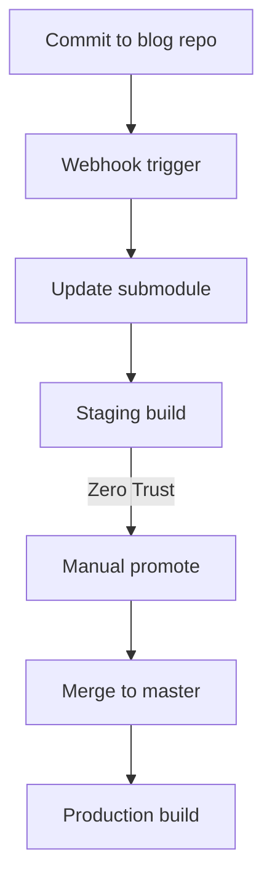

[![Contributors][contributors-shield]][contributors-url]
[![Forks][forks-shield]][forks-url]
[![Stargazers][stars-shield]][stars-url]
[![Issues][issues-shield]][issues-url]
[![project_license][license-shield]][license-url]

# Portfolio Website

This is my personal portfolio and blog, built with [Astro](https://astro.build).  
It serves as both a portfolio of projects and a place to share posts written in my [Obsidian](https://obsidian.md) vault.  

The site is deployed via [Cloudflare Pages](https://pages.cloudflare.com/) with automated builds using GitHub Actions.

---

## 📜 Table of Contents

- [Features](#features)
- [Tech Stack](#tech-stack)
- [Project Structure](#project-structure)
- [CI/CD Workflow](#cicd-workflow)
- [Contributing](#contributing)
- [License](#license)
- [Contact](#contact)
- [Acknowledgements](#acknowledgements)
- [Security Policy](#security-policy)

---

## Features

- 📝 All posts and portfolio entries written in plain Markdown  
- 📂 Organized with Obsidian vault structure for easy note-taking and linking  
- 🖼️ Images stored alongside content and synced to the web repo at build time  
- 🔄 Integrated into the web project via Git submodule for automatic updates  
- ⚡ Simple, lightweight, and version-controlled CMS  

---

## Tech Stack

[](https://astro.build/)
[](https://obsidian.md/)
[](https://www.markdownguide.org/)
[](https://www.typescriptlang.org/)


- **Framework:** Astro + TypeScript  
- **Content Management:** Markdown (Obsidian vault)  
- **CI/CD:** GitHub Actions  
- **Hosting & DNS:** Cloudflare Pages / Cloudflare DNS  
- **Integration:** Node.js scripts for asset and submodule management

---

## Project Structure

Inside of this project, you'll see the following folders and files:

```text
├── plugins/
├── public/
├── src/
│   ├── assets/
│   ├── components/
│   ├── content/ (git submodule)
│   ├── layouts/
│   ├── pages/
│   ├── styles/
│   ├── consts.ts
│   └── content.config.ts
├── astro.config.mts
├── copy-images.js
├── README.md
├── package.json
└── tsconfig.json
```

---

## CI/CD Workflow

This project uses a fully automated CI/CD pipeline that integrates GitHub Actions, Cloudflare Pages, and Cloudflare Zero Trust to ensure a secure and efficient deployment process.  

1. **Content updates** begin in the [`portfolio-blog`](https://github.com/Alexzander-Hurd/Portfolio-Blog) repository.  
   - When changes are committed, a GitHub Action sends a webhook trigger.  

2. **Staging build pipeline** runs in the [`portfolio-web`](https://github.com/Alexzander-Hurd/Portfolio-Web) repository.  
   - The webhook dispatch triggers a workflow which:  
     - Checks out the latest `staging` branch  
     - Updates the blog content submodule  
     - Commits changes back to `staging`  

3. **Cloudflare Pages staging deployment** is automatically built from the updated `staging` branch.  
   - Access to this staging build is secured using **Cloudflare Zero Trust**, ensuring only authorized testers can view it.  

4. **Promotion to production** happens after successful staging tests.  
   - A second workflow in `portfolio-web` is manually triggered via GitHub → merges `staging` into `master`.  
   - Cloudflare Pages detects the updated `master` branch and builds the **production deployment**.  



### 🔮 Planned Improvements

In the future, the manual promotion step will be replaced with a webhook-based deployment trigger.  

- A "Promote to Production" button will be exposed on the staging site UI (behind authentication).  
- This button will fire a webhook to GitHub, triggering the promotion workflow automatically.  
- Button visibility will be controlled via environment variables or Cloudflare build environments.  

---

## Contributing

This is a personal portfolio project and is not open to external contributions. However, feedback or suggestions are welcome via the [Issues](https://github.com/Alexzander-Hurd/Portfolio-Web/issues) page.

---

## License

Distributed under the MIT License. See [`LICENSE`](LICENSE) for more information.

© Alexzander Hurd

---

## Contact

- GitHub: [@Alexzander-Hurd](https://github.com/Alexzander-Hurd)
- Website: [alexhurd.uk](https://www.alexhurd.uk)
- Links: [alexhurd.uk/links](https://www.alexhurd.uk/links)

---

## Security Policy

Security disclosures and vulnerability reports will be handled via a formal [`SECURITY.md`](SECURITY.md) in the near future. For now, please contact via the email [security@alexhurd.uk](mailto:security@alexhurd.uk)

---

## Acknowledgements

- [Best README Template](https://github.com/othneildrew/Best-README-Template) - Base Template for this README
- [Astro](https://astro.build/) - Static site generator powering this project 
- [GitHub Actions](https://github.com/features/actions) - CI/CD workflows and automation  
- [Cloudflare Pages](https://pages.cloudflare.com/) - Hosting and deployment platform  
- [Cloudflare DNS](https://www.cloudflare.com/dns/) - DNS management and domain routing  
- [Node.js](https://nodejs.org/) - Runtime for pre-build scripts  
- [TypeScript](https://www.typescriptlang.org/) - Type-safe development


[contributors-shield]: https://img.shields.io/github/contributors/Alexzander-Hurd/Portfolio-Web.svg?style=for-the-badge
[contributors-url]: https://github.com/Alexzander-Hurd/Portfolio-Web/graphs/contributors
[forks-shield]: https://img.shields.io/github/forks/Alexzander-Hurd/Portfolio-Web.svg?style=for-the-badge
[forks-url]: https://github.com/Alexzander-Hurd/Portfolio-Web/network/members
[stars-shield]: https://img.shields.io/github/stars/Alexzander-Hurd/Portfolio-Web.svg?style=for-the-badge
[stars-url]: https://github.com/Alexzander-Hurd/Portfolio-Web/stargazers
[issues-shield]: https://img.shields.io/github/issues/Alexzander-Hurd/Portfolio-Web.svg?style=for-the-badge
[issues-url]: https://github.com/Alexzander-Hurd/Portfolio-Web/issues
[license-shield]: https://img.shields.io/github/license/Alexzander-Hurd/Portfolio-Web.svg?style=for-the-badge
[license-url]: https://github.com/Alexzander-Hurd/Portfolio-Web/blob/master/LICENSE